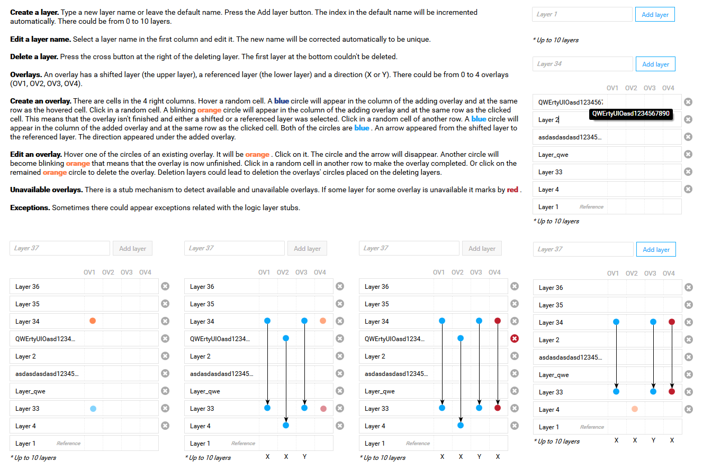
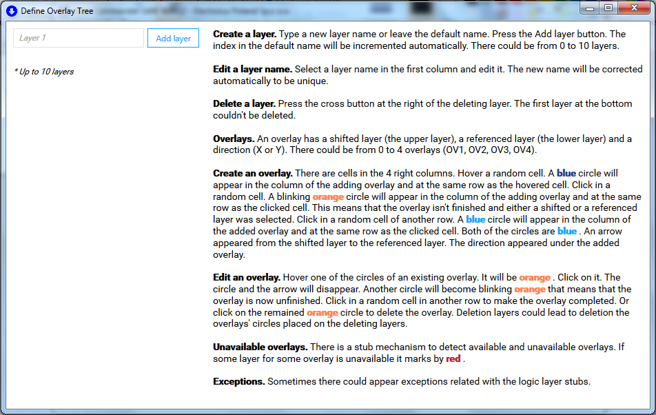
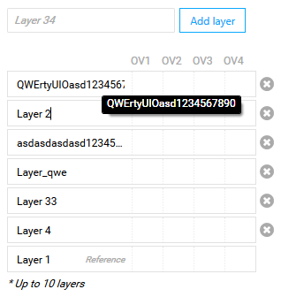
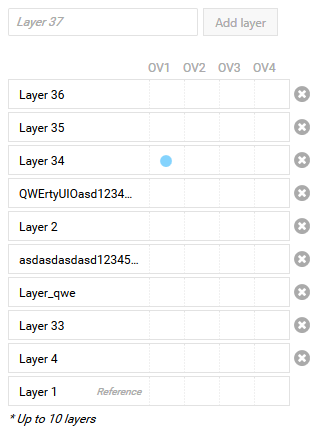
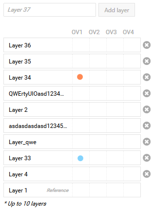
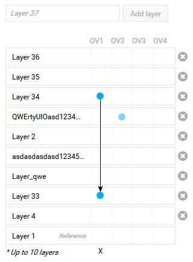
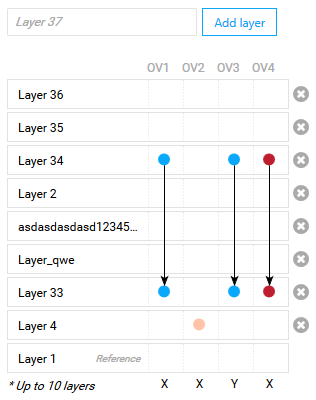
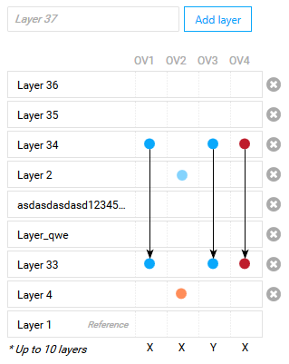
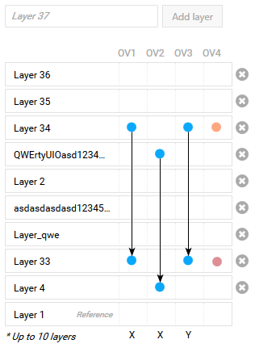
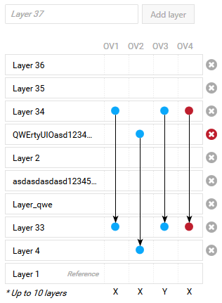

# Демонстративное приложение "Панель определения наложений" (DefineOverlayPanel)

## Назначение программы
Это приложение для демонстрации элементов управления WPF.
Приложение имеет встроенную справку.

## Средства разработки
- **Среда разработки**: Microsoft Visual Studio 2017.
- **Программная платформа**: Microsoft .NET Framework 4.5. с подсистемой Windows Presentation Foundation (WPF).
- **Языки программирования**: C# 7.0, XAML.
- **Операционная система**: Windows 7, Windows 10.

## Вклад автора в программу
Автор принимала участие в командной разработке большой системы.
В данном приложении автором полностью разработаны следующие классы.

1. Элемент управления GraphicalOverlayView для графического отображения слоёв (layers) и перекрытий (overlays):
DefineOverlayTree\DefineOverlayTree\DefineOverlayPanel\GraphicalOverlayView

2. Все классы, кроме OverlayService, панели DefineOverlayPanel для создания перекрытий:
DefineOverlayTree\DefineOverlayTree\DefineOverlayPanel

3. Заглушки (stubs) для имитации работы логического слоя (Logic Layer):
DefineOverlayTree\DefineOverlayTree\LogicStubs

4. Некоторые стили, например, WaterMarkInnerTextBlockStyle из ресурсов словарей:
DefineOverlayTree\DefineOverlayTree\Styles

5. Тесты (UnitTests) для панели DefineOverlayPanel:
DefineOverlayTree\DefineOverlayTree.UnitTests\DefineOverlayPanel

## Описание программы

Справа расположена панель DefineOverlayPanel.
Слева представлена встроенная справка работы программы.

### Создайте слой

Введите имя нового слоя или оставьте имя по умолчанию.
Нажмите кнопку «Add layer».
Индекс в имени по умолчанию будет увеличен автоматически.
Там может быть от 0 до 10 слоев.

### Отредактируйте имя слоя
Выберите имя слоя в первом столбце и отредактируйте его.
Новое имя будет исправлено автоматически так, чтобы оно было уникальным.

### Удалить слой
Нажмите кнопку с крестиком справа от удаляемого слоя.
Первый слой внизу не может быть удален.

### Наложения
Наложение имеет shifted layer (верхний слой), referenced layer (нижний слой) и направление (X или Y).
Может быть от 0 до 4 наложений (OV1, OV2, OV3, OV4).

### Создать наложение

В четырёх правых столбцах есть ячейки. Наведите указатель мыши на случайную ячейку.
Синий кружок появится в столбце добавляемого наложения и в той же строке, что и ячейка, на которую наведена мышь.

Кликните по случайной ячейке. Мигающий оранжевый кружок появится в столбце добавляемого наложения и в той же строке, что и ячейка, по которой кликнули.
Это означает, что наложение не закончено и был выбран либо смещенный (shifted), либо ссылочный (referenced) слой.

Нажмите на случайную ячейку в другой строке.
Синий кружок появится в столбце добавленного наложения и в той же строке, что и выбранная ячейка.
Оба кружка будут синими. Стрелка появилась от верхнего слоя к нижнему.
Направление появилось под добавленным наложением.

### Отредактируйте наложение

Наведите указатель мыши на один из кружков существующего наложения. Он будет оранжевым.
Нажмите на него. Этот кружок и стрелка, связанная с ним, исчезнут.
Другой кружок станет мигающим оранжевым, что означает, что наложение теперь не завершено.

Нажмите на случайную ячейку в другом ряду, чтобы завершить наложение.
Или нажмите на оставшийся оранжевый кружок, чтобы удалить наложение.
Удаление слоев может привести к удалению кружков наложений, размещенных на удаляемых слоях.

### Недоступные оверлеи

В заглушках (stubs) существует механизм для обнаружения доступных и недоступных наложений.
Если какой-либо слой для какого-либо наложения недоступен, он помечается красным кружком.

### Исключения
Иногда в процессе работы программы выскакивают исключения, связанные с с кратким алгоритмом заглушек (stubs) для логического слоя (Logic Layer).

## Текст справки на английском языке

### Create a layer
Type a new layer name or leave the default name. Press the Add layer button. 
The index in the default name will be incremented automatically. 
There could be from 0 to 10 layers.
 
### Edit a layer name
Select a layer name in the first column and edit it. The new name will be corrected automatically to be unique. 
Delete a layer. 
Press the cross button at the right of the deleting layer. The first layer at the bottom couldn't be deleted. 

### Overlays
An overlay has a shifted layer (the upper layer), a referenced layer (the lower layer) and a direction (X or Y). 
There could be from 0 to 4 overlays (OV1, OV2, OV3, OV4). 

### Create an overlay
There are cells in the 4 right columns. Hover a random cell.
A blue circle will appear in the column of the adding overlay and at the same row as the hovered cell. 

Click in a random cell.
A blinking orange circle will appear in the column of the adding overlay and at the same row as the clicked cell. 

This means that the overlay isn't finished and either a shifted or a referenced layer was selected.

Click in a random cell of another row.
A blue circle will appear in the column of the added overlay and at the same row as the clicked cell.
 
Both of the circles are blue.
An arrow appeared from the shifted layer to the referenced layer.
The direction appeared under the added overlay. 

### Edit an overlay
Hover one of the circles of an existing overlay.
It will be orange.

Click on it.
The circle and the arrow will disappear.

Another circle will become blinking orange that means that the overlay is now unfinished.
Click in a random cell in another row to make the overlay completed. 

Or click on the remained orange circle to delete the overlay. 

Deletion layers could lead to deletion the overlays' circles placed on the deleting layers.

### Unavailable overlays
There is a stub mechanism to detect available and unavailable overlays. 
If some layer for some overlay is unavailable it marks by red.

### Exceptions
Sometimes there could appear exceptions related with the logic layer stubs.

## Статус проекта
Проект завершён.

## Контакты
Котова Екатерина Александровна,
e-mail: katekotova_86@mail.ru